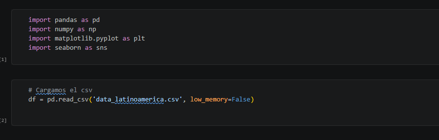
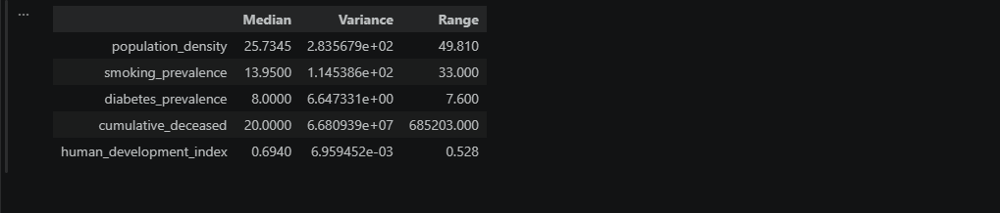
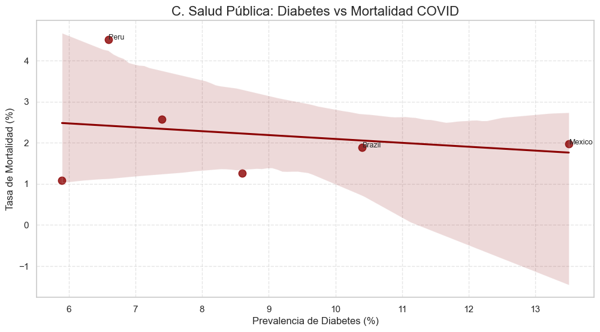
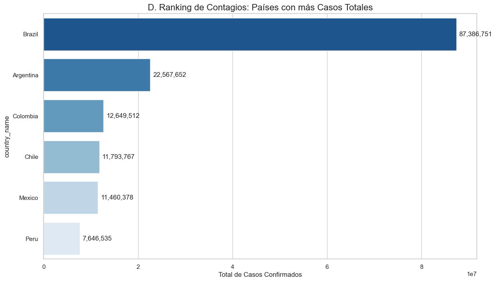
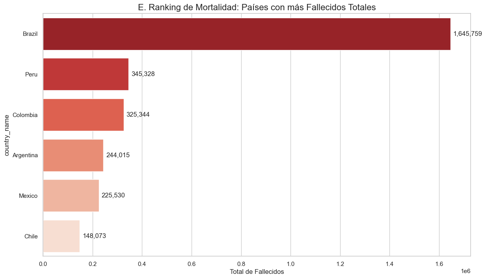
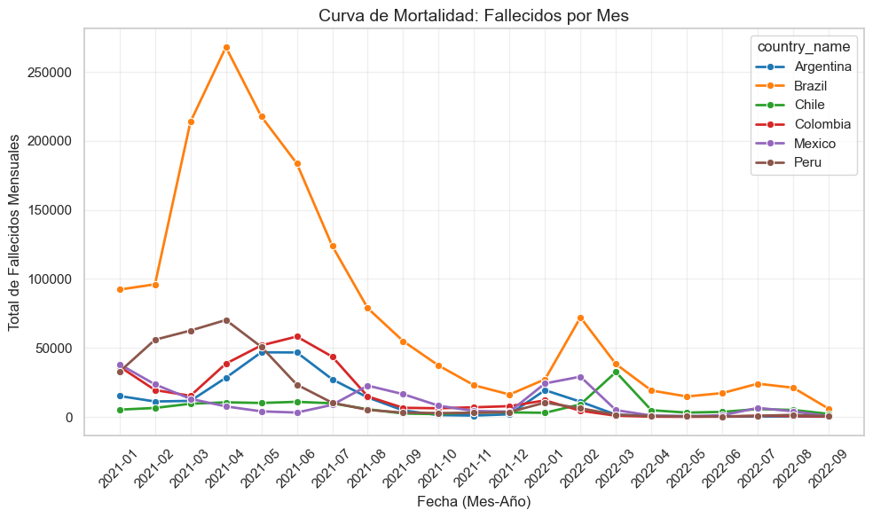
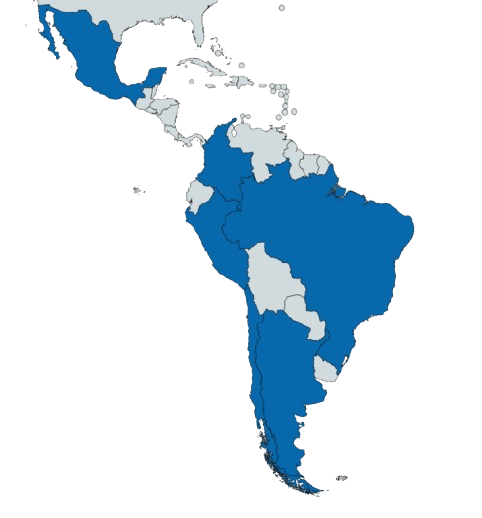

# Informe Final de Consultoría: Proyecto Biogenesys Farma

## 1. Introducción
Este proyecto tiene como objetivo identificar la ubicación estratégica óptima para la expansión de **Biogenesys Farma** en Latinoamérica. El análisis se centra en el equilibrio entre el volumen de mercado, la infraestructura sanitaria y los factores de riesgo epidemiológicos.

---

## 2. Metodología y Procesamiento de Datos (ETL)
Para asegurar la fiabilidad del análisis, se procesó un dataset masivo de **12,216,057 filas** mediante Python. Se realizó una limpieza profunda de valores nulos y normalización de variables demográficas y de salud.

*Captura del proceso de ingesta y volumen de datos procesados.*

### Métricas de Calidad
Se calcularon estadísticas descriptivas clave (Mediana, Varianza y Rango) para validar la dispersión de los datos en indicadores como el IDH (poder adquisitivo) y la densidad poblacional.

---

## 3. Análisis Epidemiológico y Factores de Riesgo
El análisis reveló una correlación directa entre las comorbilidades preexistentes y las tasas de mortalidad en la región.

### Drivers de Riesgo
Identificamos que la diabetes y el tabaquismo son los principales predictores de severidad en la demanda sanitaria.

*Análisis de correlación entre factores de riesgo y mortalidad.*

### Relación Diabetes vs Mortalidad
Como se observa en la siguiente visualización, los países con mayor prevalencia de enfermedades crónicas presentan una curva de fallecidos más pronunciada, lo que representa un mercado crítico para tratamientos farmacéuticos.

---

## 4. Comparativa Regional y Evolución Temporal
Analizamos el impacto histórico por país para dimensionar el tamaño de la infraestructura necesaria en la nueva sede.

| Análisis por Contagios | Análisis por Fallecidos |
| :---: | :---: |
|  |  |

### Tendencia Temporal
El seguimiento mensual de la mortalidad permite proyectar la estabilidad de la demanda en el tiempo, asegurando que la inversión no responda solo a picos estacionales.

---

## 5. Conclusión: Ubicación Óptima
Tras cruzar las variables de volumen crítico, IDH y factores de riesgo, la recomendación estratégica es establecer la **Sede Central en BRASIL**.

### Justificación de la decisión:
1. **Volumen Crítico:** Brasil concentra aproximadamente el 50% de la demanda regional analizada, permitiendo economías de escala inmediatas.
2. **Infraestructura y Necesidad:** La correlación entre densidad poblacional y enfermedades crónicas asegura un mercado recurrente y sostenible.
3. **Complemento Regional:** Chile y Argentina se identifican como mercados secundarios de alto valor para productos de línea premium debido a su elevado IDH.

---

## 6. Reflexión Personal
El desarrollo de este proyecto permitió consolidar la integración técnica entre **Python (Pandas/Seaborn)** y **Power BI**. La principal lección aprendida fue la importancia crítica del pre-procesamiento de datos: una limpieza robusta desde el inicio garantiza una visualización clara y una toma de decisiones ejecutivas basada en evidencia sólida.

---
**Analista:** Melanie Evelyn Lopez 
**Herramientas:** Python, SQL, Power BI, DAX.
